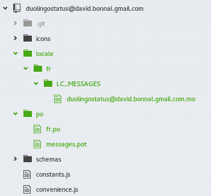

# Translate your extension!

I haven’t found so much documentation about changing the language of your Gnome-shell extension, except for this very useful – but still a bit confusing - [link](https://wiki.gnome.org/Projects/GnomeShell/Extensions/FAQ/CreatingExtensions).

As a requirement, when you write your extension, all the translatable strings should be written like this: **_(‘my string that will be translated’)**.

As I have looked at some different other extensions, it seems that the use of the **underscore** character is commonly used.

### Create a new translation

First of all, we must import the **gettext** module. Then we bind a function name (which is the **underscore** character) to the **gexttext()** method.

Here we go, let’s code  :simple_smile:. In all source files having a translatable string, let’s write the following for the initialization:

```javascript
const Gettext = imports.gettext;
const _ = Gettext.gettext;

_init: function() {
    Gettext.textdomain(Me.uuid);
    Gettext.bindtextdomain(Me.uuid, Me.dir.get_child(‘locale’).get_path());
}
```

This is the only code, all the rest to do is some commands to type.

As I tend to do myself, create a folder called **po** at the root, that will contain the translation files (you can also store them at the root of the extension), then execute the following command:

> mkdir po
> xgettext -k_ -kN_ -o po/messages.pot extension.js file1.js prefs.js

This command references all the translatable strings from the files extension.js, file1.js and prefs.js into the file messages.pot.

Let’s now create a locale file, for a first translation. In the same folder, execute:
> LANG=fr_FR msginit

It creates the file **fr.po** that contains the keys and the values of the translatable strings. You can now start translating your extension.

The next step is now to make in sort that your application uses your translations. From the root of your extension folder, execute the following command creating the folder that will contain the file that our extension can actually interprets, upon our previous translations:
> mkdir -p locale/fr/LC_MESSAGES

And now, the creation of the machine language translation file:
> msgfmt po/fr.po -o locale/fr/LC_MESSAGES/my-extension.mo

In the end, if you followed my instructions, the resulting tree view should be like this (the green files):



That’s it! If needed, restart Gnome-shell, and your translation should be active.
Update a translation

### Update the translation

If you add new strings to translate in your extension, you need to update the **.po** file. If you include a new source file, you must first re-run the command xgettext as previously, adding the new file.
> xgettext -k_ -kN_ -o po/messages.pot extension.js file1.js prefs.js another_file.js

Then run the following command that will update your fr.po file with the new string to translate (for me it creates a backup file called **~fr.po**):
> msgmerge -U po/fr.po po/messages.pot

It preserves the translations already in place.

And finally again, the command updating the machine language file:
> msgfmt po/fr.po -o locale/fr/LC_MESSAGES/my-extension.mo

### Change the encoding

By default on my computer, the encoding was ISO-something. Change it in your .po file with the encoding of your choce, here UTF-8:
> “Content-Type: text/plain; charset=UTF-8\n”